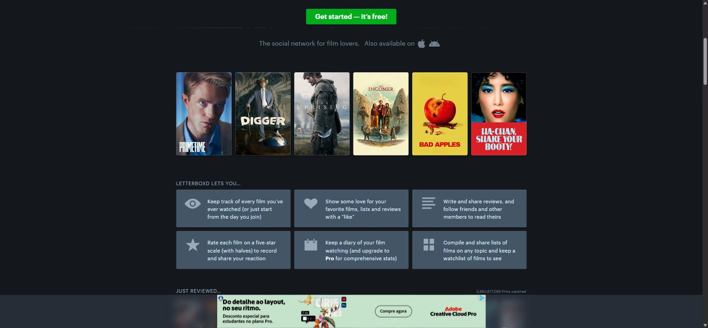
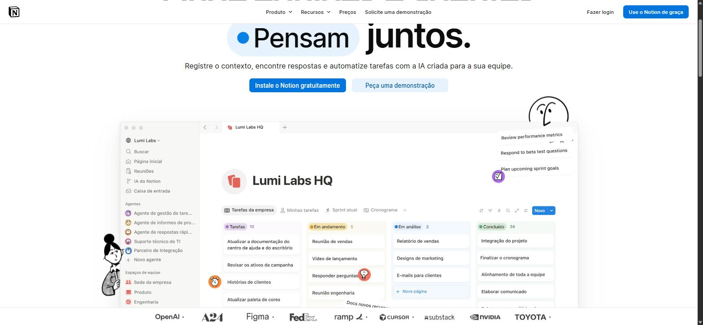
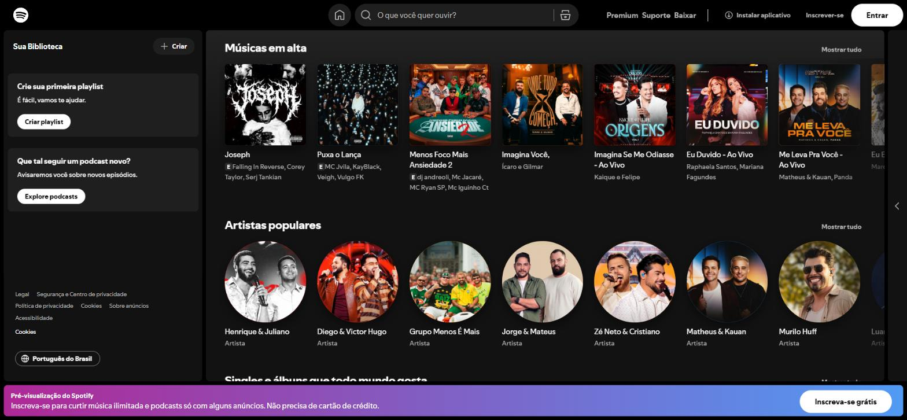

# References — Filmes Online

## 1. Objetivo

As referências abaixo orientam as decisões de experiência e interface do Filmes Online,
focado no problema "organizar o que já foi assistido".

## 2. Referência 01 — Letterboxd

### Fonte
https://letterboxd.com/

### Imagem

### O que observamos?
A seção "Letterboxd lets you..." apresenta, em um grid de 6 cartões, cada
funcionalidade principal do produto acompanhada de um ícone simples (olho,
coração, estrela, calendário, grade). O destaque central da página também usa
a frase "Track films you've watched" como proposta de valor direta.

### O que vamos aproveitar?
A ideia de comunicar a funcionalidade central (organizar o que já foi
assistido) logo na Hero, com uma frase direta e um call-to-action, e usar
ícones para reforçar rapidamente o que cada ação representa (assistido,
buscar, remover).

### Como será adaptado?
No Filmes Online, a Hero da Home usa a mesma lógica de mensagem direta ("Nunca mais
esqueça o que já assistiu") com um único CTA levando à página de organização.
Nos cards de filme/série, ícones de filme/série (react-icons) substituem os
ícones de olho/estrela do Letterboxd para indicar o tipo de conteúdo.

## 3. Referência 02 — Notion

### Fonte
https://www.notion.com/product

### Imagem

### O que observamos?
O mockup do produto mostra um board organizado em colunas por status
("Tarefas", "Em andamento", "Em análise", "Concluído"), cada uma com uma cor e
uma contagem de itens, além de botões de filtro/ordenação no topo da tabela.

### O que vamos aproveitar?
A separação de conteúdo por categorias com contagem visível, e controles de
filtro simples e acessíveis no topo da lista, para deixar claro quanto já foi
organizado e permitir refinar a visualização rapidamente.

### Como será adaptado?
Na página "Meus assistidos", a lista mostra a contagem total entre parênteses
no título da seção ("Minha lista de assistidos (N)") e usa botões de filtro
(Todos / Filmes / Séries) no mesmo padrão visual de pílulas, próximos ao
título, para organizar os itens sem precisar de uma tela extra.

## 4. Referência 03 — Spotify

### Fonte
https://open.spotify.com/

### Imagem

### O que observamos?
A tela inicial organiza o conteúdo em fileiras de cards de largura fixa
("Músicas em alta", "Artistas populares"), cada card com imagem, título e
subtítulo, dentro de um grid responsivo que se adapta ao tamanho da tela.

### O que vamos aproveitar?
O padrão de card compacto (imagem + título + informação secundária) para
representar cada item de forma consistente, tanto nos resultados de busca
quanto na lista de assistidos.

### Como será adaptado?
O componente MovieCard do Filmes Online segue esse padrão: pôster no topo, tipo do
conteúdo, título e ano/data logo abaixo, organizados em um grid responsivo
(`auto-fill`) que se ajusta ao número de itens, igual ao comportamento das
fileiras de cards do Spotify.
